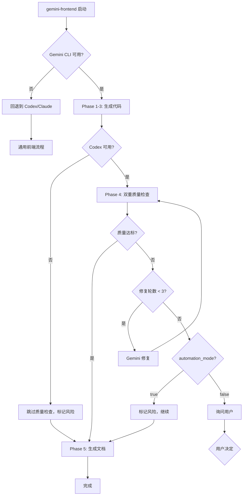

# gemini-frontend - Gemini CLI 前端开发专用 Skill

## Description

专注于前端和移动端开发的 skill，通过 Gemini CLI（via clink）发挥多模态和超长上下文优势。

**适用场景：**
- React/Vue/Angular 组件开发
- React Native/Flutter 移动端开发
- 设计稿 → 前端代码实现
- UI/UX 实现和优化
- 前端项目重构

**核心优势（基于 Gemini 3.0）：**
- 📷 **多模态能力**：直接理解设计稿、UI 截图
- 📚 **超长上下文**：100万 token，处理大型 monorepo
- 🎨 **UI 理解**：博士级推理能力，理解复杂 UI 逻辑
- 🚀 **代码生成**：擅长 React/Vue/Flutter 代码生成

---

## ⚠️ 重要说明

**阶段命名澄清：**
- 本 skill 的 **Phase 1-5** 是内部工作流阶段（Skill-level phases）
- 与 CLAUDE.md 的 **P1-P4**（分析问题、制定方案、执行方案、错误处理）是不同层级
- gemini-frontend 通常在 **P3（执行方案）** 阶段被 main-router 调用
- Phase 1-5 是在 P3 阶段内部顺序执行的子步骤

**层级关系示例：**
```
P3（执行方案） [CLAUDE.md 项目阶段]
  └─ gemini-frontend skill [由 main-router 调用]
      ├─ Phase 1: 初始化 Gemini CLI 会话
      ├─ Phase 2: 需求分析与设计
      ├─ Phase 3: 代码生成
      ├─ Phase 4: 质量检查
      └─ Phase 5: 文档生成
```

---

## How It's Invoked（如何被调用）

**调用方式：** 由 **main-router skill** 自动路由

**路由触发条件：**
- 用户请求包含前端框架关键词（React, Vue, Angular, Flutter, React Native）
- 用户请求包含 UI/组件/页面 等关键词
- 用户提供设计稿/UI 截图
- frontend_score ≥ 50（参见 main-router 评分机制）

**评分机制详解：**

main-router 使用以下评分规则判断是否路由到 gemini-frontend：

| 评分项 | 分值 | 示例关键词 |
|--------|------|------------|
| Tier 1 关键词 | +30~35分 | React, Vue, Angular, component, 组件, 页面, UI, 前端 |
| Tier 2 关键词 | +15~20分 | Flutter, React Native, mobile, 移动端, iOS, Android |
| Tier 3 上下文 | +10分 | package.json 存在且包含前端依赖 |
| 图片附件 | +25分 | 设计稿、UI 截图 |
| 后端信号抵消 | -15~-25分 | API, backend, database, FastAPI, Django |

**路由决策阈值：**
- **Score ≥ 80**：自动路由到 gemini-frontend（高置信度）
- **Score 50-79**：询问用户是否使用 gemini-frontend（中置信度）
- **Score < 50 且 backend_signals ≥ 2**：全栈项目，建议任务分解

**参数继承：**
- `automation_mode`: 从 main-router 继承（见 CLAUDE.md 共享概念）
- `coverage_target`: 从 main-router 继承（默认 85%，最低 70%）

**示例流程：**
```
用户请求: "帮我开发一个 React 登录组件"
  ↓
main-router 检测:
  - "React" (Tier 1) → +35分
  - "组件" (Tier 1) → +30分
  - 总分: 65分
  ↓
路由决策: 50 ≤ 65 < 80 → 询问用户
  ↓
用户确认: "是"
  ↓
调用 gemini-frontend skill
  ↓
gemini-frontend 执行 Phase 1-5
  ↓
返回完整的 React 组件 + 文档 + 质量报告
```

**详细示例：** 参见 `skills/main-router/references/routing_examples.md` 示例 12-13

---

## Workflow（5 阶段工作流）

### Phase 1: 初始化 Gemini CLI 会话

**目标：** 通过 clink 启动 Gemini CLI，建立会话上下文

**操作：**
```python
session = clink(
    prompt="启动 Gemini CLI 进行前端开发",
    cli_name="gemini",
    role="default"
)
session_id = session["continuation_id"]
```

**环境自适应（G10 合规）：**

在调用 clink 前，必须检测操作系统环境：

```python
import platform
import os

def get_cli_environment():
    """环境自适应 CLI 调用（遵循 G10 规范）"""
    os_type = platform.system()

    if os_type == "Windows":
        # 检测是否在 WSL 中
        if os.path.exists("/mnt/c"):
            return "wsl"
        else:
            return "windows"
    elif os_type == "Linux":
        return "linux"
    elif os_type == "Darwin":
        return "macos"
    else:
        raise EnvironmentError(f"不支持的操作系统: {os_type}")

# Phase 1 中使用环境自适应
env = get_cli_environment()
session = clink(
    prompt="启动 Gemini CLI 进行前端开发",
    cli_name="gemini",
    role="default"
)
```

**重要提示：** 详见 `references/standards/cli_env_g10.md` 获取完整的环境自适应规范。

**输出：** Gemini CLI 会话 ID（用于后续 Phase）

---

### Phase 2: 需求分析与设计

**目标：** 利用 Gemini 多模态能力分析前端需求

**操作：**
```python
analysis = clink(
    prompt=f"""
    分析以下前端需求：
    {user_request}

    **前置检查（G6 合规 - 遵循既有架构决策）：**
    1. 读取 PROJECTWIKI.md 的 ADR（Architecture Decision Record）部分
    2. 检查现有架构决策是否与本次需求冲突
    3. 如有冲突，提供替代方案或修订建议
    4. 标注需要遵循的架构约束

    请提供：
    1. 组件架构设计（遵循既有 ADR 和架构决策）
    2. 状态管理方案（符合项目现有模式）
    3. 样式实现策略（遵循项目规范）
    4. 技术栈建议（考虑现有技术栈兼容性）
    5. ADR 冲突检查结果（如有）
    """,
    cli_name="gemini",
    files=design_files + ["PROJECTWIKI.md"] if design_files else ["PROJECTWIKI.md"],  # 包含项目文档
    continuation_id=session_id
)
```

**特殊处理：**
- 如有设计稿/UI 截图，通过 `files` 参数传递
- Gemini 会自动识别图片内容并生成对应代码

**输出：** 前端设计方案（架构、状态管理、样式策略）

---

### Phase 3: 代码生成

**目标：** Gemini 生成高质量前端代码

**操作：**
```python
code = clink(
    prompt="""
    基于上述设计方案，生成完整的前端代码，包括：
    1. 组件代码（.tsx/.vue）
    2. 样式文件（.css/.scss/Tailwind）
    3. 类型定义（TypeScript）
    4. 状态管理代码（Redux/Zustand）
    5. 单元测试（Jest/Vitest）

    确保：
    - 代码符合最佳实践
    - 遵循项目现有规范
    - 包含必要的注释
    - 类型安全
    """,
    cli_name="gemini",
    continuation_id=session_id
)
```

**输出：** 完整的前端代码文件

---

### Phase 4: 质量检查（强制，双重验证）

**目标：** 确保代码质量达到发布标准

**操作（强制双轮）：**

**第 1 轮：codereview 工作流验证**
```python
review_round1 = codereview(
    code=code,
    review_type="full",  # 全面审查
    focus_on="frontend",  # 前端特定检查
    standards="项目前端规范"
)
```

**第 2 轮：codex CLI 深度分析**
```python
# 启动 codex CLI
codex_session = clink(
    prompt="启动 codex CLI 进行代码审查",
    cli_name="codex",
    role="codereviewer"
)

# 深度分析
review_round2 = clink(
    prompt=f"""
    深度审查以下前端代码：
    {code}

    重点关注：
    1. React/Vue 最佳实践
    2. 性能优化（Lazy Loading、Memoization）
    3. 可访问性（a11y）
    4. 安全性（XSS、CSRF）
    5. 类型安全
    """,
    cli_name="codex",
    continuation_id=codex_session["continuation_id"]
)
```

**质量闸门（必须通过）：**
- 代码质量评分 ≥ 85%
- 无 Critical/High 级别问题
- 类型检查通过
- 测试覆盖率 ≥ coverage_target（从 router 继承）

**如不合格：**
```python
# Gemini 修复（最多 3 轮）
for i in range(3):
    if review["quality_score"] >= 85:
        break

    code = clink(
        prompt=f"修复以下问题：\n{review['issues']}",
        cli_name="gemini",
        continuation_id=session_id
    )

    review = codereview(code)
```

**可选增强（Gemini 2.5 Pro 建议）：**
```bash
# 静态分析 Linting
npm run lint
npm run type-check
```

**输出：** 质量检查报告 + 修复后的代码

---

### Phase 5: 文档生成

**目标：** 更新项目文档

**操作：**
```python
docs = simple_gemini(
    prompt="""
    更新 PROJECTWIKI.md，包括：

    1. 新增组件文档
    2. API 使用示例
    3. 组件 Props 说明

    **4. 架构图更新（Mermaid）- G4 合规要求：**
       - 更新组件依赖关系图（使用 flowchart）
       - 更新数据流图（使用 sequenceDiagram）
       - 标注新增组件的位置和关系
       - 清理过时的架构节点
       - 提供节点 ID ↔ 代码路径映射表

       示例：
       \```mermaid
       flowchart TD
           App[App] --> LoginForm[LoginForm 组件]
           LoginForm --> AuthService[认证服务]
           AuthService --> API[Backend API]
       \```

    5. CHANGELOG.md 更新（遵循 Keep a Changelog 格式）
    6. 建立代码 ↔ PROJECTWIKI.md 的双向链接（G1 要求）
    """,
    context={
        "code": code,
        "review": review,
        "project_info": context
    }
)
```

**输出：**
- 更新的 PROJECTWIKI.md
- 更新的 CHANGELOG.md
- 组件使用文档

---

## Parameters（输入参数）

| 参数 | 类型 | 必填 | 说明 |
|------|------|------|------|
| `user_request` | string | ✅ | 用户的前端开发需求 |
| `design_files` | list[string] | ❌ | 设计稿/UI 截图路径（绝对路径） |
| `project_type` | string | ❌ | 项目类型：react/vue/angular/react-native/flutter |
| `automation_mode` | boolean | ❌ | 继承自 router，默认 false |
| `coverage_target` | int | ❌ | 测试覆盖率目标（默认 85%） |
| `context` | object | ❌ | 项目上下文信息 |

---

## Output（输出）

```json
{
  "code": {
    "components": ["path/to/component1.tsx", "..."],
    "styles": ["path/to/styles.css", "..."],
    "tests": ["path/to/test.spec.ts", "..."]
  },
  "review": {
    "quality_score": 92,
    "issues_found": 2,
    "issues_fixed": 2,
    "final_status": "passed"
  },
  "docs": {
    "projectwiki_updated": true,
    "changelog_updated": true
  },
  "metrics": {
    "total_time": "180s",
    "gemini_calls": 3,
    "codex_calls": 2
  }
}
```

---

## Error Handling（错误处理）

### 1. Gemini CLI 不可用

```python
try:
    session = clink(cli_name="gemini", ...)
except CLINotAvailable:
    # 回退到 Claude/Codex
    fallback_skill = "codex-code-reviewer"
    log_event("gemini_unavailable", {"fallback": fallback_skill})
    notify_user("当前 Gemini 前端助手不可用，已切换到通用模式")
    return route_to(fallback_skill)
```

### 2. 代码质量不达标

```python
if review["quality_score"] < 85 and iteration >= 3:
    # 3 轮修复仍不达标
    log_event("quality_check_failed", {
        "score": review["quality_score"],
        "iterations": iteration
    })

    if automation_mode:
        # 自动模式：标记风险但继续
        notify_user(f"⚠️ 代码质量({review['quality_score']}%)未达标，请人工审查")
    else:
        # 交互模式：询问用户
        ask_user("代码质量未达标，是否继续？")
```

### 3. 超时处理

```python
TIMEOUT_LIMITS = {
    "gemini_per_call": 120,  # 2分钟
    "total_workflow": 600     # 10分钟
}

if time.elapsed() > TIMEOUT_LIMITS["total_workflow"]:
    notify_user("⏱️ 前端开发超时，已生成部分代码，请手动完成")
    return partial_result
```

---

## Fallback Strategy（回退策略）

根据多专家共识，必须设计完善的回退机制：

### 回退决策树



### 回退优先级

| 场景 | 回退方案 | 用户通知 |
|------|---------|---------|
| Gemini 不可用 | Codex/Claude 全权处理 | "前端专用助手不可用，已切换" |
| Codex 不可用 | Gemini 生成 + 跳过审查 | "未进行质量检查，请谨慎" |
| 两者都不可用 | 主模型直接处理 | "AI 助手不可用，使用基础模式" |
| 质量不达标 | 人工介入 | "需要人工审查" |

---

## Performance Optimization（性能优化）

### 任务复杂度判断（GPT-5.1 建议）

```python
def estimate_task_complexity(user_request, context):
    """估算任务复杂度，决定是否启用完整 pipeline"""

    score = 0

    # 提示长度
    if len(user_request) > 500:
        score += 30

    # 文件数量
    file_count = len(context.get("files", []))
    score += min(file_count * 10, 40)

    # 涉及的组件数量
    component_keywords = ["组件", "component", "页面", "page"]
    component_count = sum(1 for kw in component_keywords if kw in user_request)
    score += component_count * 15

    # 复杂度分类
    if score >= 70:
        return "large"    # 大任务：完整 pipeline
    elif score >= 30:
        return "medium"   # 中任务：完整 pipeline
    else:
        return "small"    # 小任务：快速路径

# 快速路径（小任务）
if complexity == "small":
    # 跳过双重检查，仅 Gemini 生成
    skip_codex_review = True
    notification = "小任务快速模式，跳过部分检查"
```

---

## Monitoring（监控指标）

根据专家建议，必须建立监控：

```python
METRICS_TO_TRACK = {
    # 路由命中率
    "frontend_route_hit_rate": "前端路由命中次数 / 总请求",
    "fullstack_detection_rate": "全栈检测次数 / 前端路由次数",

    # 性能指标
    "avg_total_time": "平均总耗时",
    "gemini_avg_time": "Gemini 平均响应时间",
    "codex_avg_time": "Codex 平均审查时间",

    # 质量指标
    "quality_pass_rate": "质量检查通过率",
    "avg_quality_score": "平均质量评分",
    "fix_iteration_avg": "平均修复轮数",

    # 用户体验
    "user_satisfaction": "用户满意度（如有反馈）",
    "fallback_rate": "回退到其他 skill 的比率"
}
```

---

## Configuration（配置项）

```yaml
# skills/config/gemini-frontend.yml

skill_name: gemini-frontend
version: 1.0.0

# 评分阈值（可调整）
scoring:
  auto_route_threshold: 80    # 自动路由
  confirm_threshold: 50       # 询问用户
  backend_signal_weight: -15  # 后端信号抵消权重

# 质量检查
quality:
  min_score: 85               # 最低质量分数
  max_fix_iterations: 3       # 最大修复轮数
  enable_linting: true        # 启用静态分析
  coverage_target: 85         # 默认覆盖率目标

# 性能
performance:
  complexity_threshold:
    large: 70
    medium: 30
  timeout:
    gemini_per_call: 120
    total_workflow: 600

# 回退策略
fallback:
  primary: "codex-code-reviewer"
  secondary: "main-model"
  notify_user: true

# 监控
monitoring:
  enabled: true
  log_all_decisions: true
  track_metrics: true
```

---

## Usage Examples（使用示例）

### 示例 1: React 组件开发

```markdown
用户: "帮我开发一个 React 的用户卡片组件，支持 hover 效果和点击事件"

→ main-router 检测:
  - "React"(35分) + "组件"(30分) = 65分
  - 推荐: auto_route (≥80? 否, ≥50? 是)
  - 实际: ask_user (模糊区间)

→ 用户确认: "是，使用 Gemini 前端助手"

→ gemini-frontend 执行:
  Phase 1: 启动 Gemini CLI ✅
  Phase 2: 分析需求 → 组件架构设计 ✅
  Phase 3: 生成代码 → UserCard.tsx + UserCard.module.css ✅
  Phase 4: 质量检查 → codereview(92分) ✅
  Phase 5: 更新文档 → PROJECTWIKI.md ✅

→ 输出: 完整的 UserCard 组件 + 文档
```

### 示例 2: 设计稿 → 代码

```markdown
用户: "根据这个设计稿生成 Vue 组件" [附件: design.png]

→ main-router 检测:
  - "Vue"(35分) + "组件"(30分) + "设计稿+图片"(25分) = 90分
  - 推荐: auto_route (高置信度)

→ gemini-frontend 执行:
  Phase 1: 启动 Gemini CLI ✅
  Phase 2: 分析设计稿 → 识别UI元素、颜色、布局 ✅
  Phase 3: 生成代码 → ProductCard.vue + Tailwind classes ✅
  Phase 4: 质量检查 → codereview(88分) ✅
  Phase 5: 更新文档 ✅

→ 输出: 高度还原设计稿的 Vue 组件
```

### 示例 3: 全栈项目（分拆处理）

```markdown
用户: "开发一个用户登录功能，包括前端 React 表单和后端 Node.js API"

→ main-router 检测:
  - "React"(35分) + "Node.js"(-15分) + "API"(-10分) = 10分
  - 后端信号: 2个 (Node.js, API)
  - 推荐: fullstack

→ main-router 分拆:
  前端部分: 路由到 gemini-frontend
  后端部分: 路由到 codex-code-reviewer

→ gemini-frontend 执行（仅前端）:
  生成: LoginForm.tsx + 状态管理 + 表单验证

→ codex-code-reviewer 执行（仅后端）:
  生成: /api/login 路由 + JWT 认证

→ 主模型整合:
  输出完整方案（前端 + 后端 分块说明）
```

---

## Related Skills（相关技能）

| Skill | 关系 | 使用时机 |
|-------|------|---------|
| `main-router` | 上游 | 检测前端需求并路由 |
| `codex-code-reviewer` | 协作 | Phase 4 质量检查 |
| `simple-gemini` | 协作 | Phase 5 文档生成 |
| `plan-down` | 可选 | 复杂前端项目规划 |
| `zen-thinkdeep` | 可选 | 复杂架构决策分析 |

---

## Version History

- **v1.0.0** (2025-11-19): 初始版本
  - 基于 thinkdeep 深度分析
  - 经 GPT-5.1 和 Gemini 2.5 Pro 多专家验证
  - 实现评分机制 + 双重质量检查 + 回退策略

---

## References

- [Gemini 3.0 前端开发能力分析](https://help.apiyi.com/gemini-3-pro-preview-2025-ultimate-guide.html)
- [前端开发最佳实践 2025](https://www.arryblog.com/guide/web-learning-route.html)
- [React/Vue 逻辑复用技术](https://comate.baidu.com/zh/page/f84z3s8i7e0)
- GPT-5.1 专家建议（Consensus 2025-11-19）
- Gemini 2.5 Pro 专家建议（Consensus 2025-11-19）
